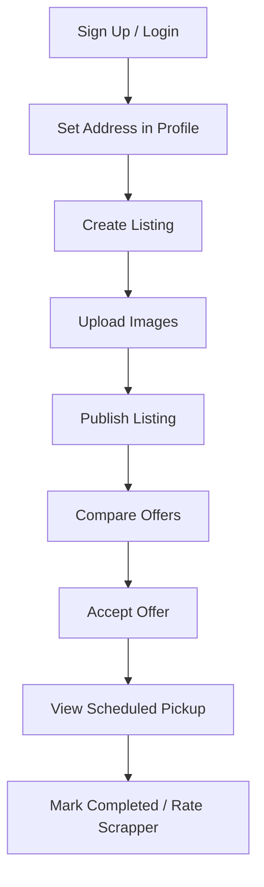
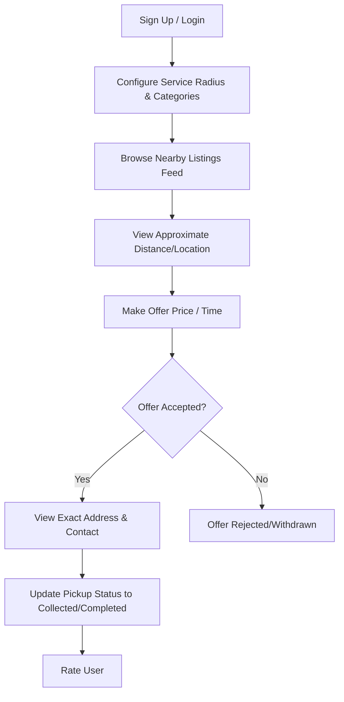

# ScrapNet Architecture & Workflows

This document outlines the architecture, data flow, security model, and key workflows of the ScrapNet marketplace.

## High-Level Architecture

```
                       [ ScrapNet App ]
                     React + Vite + Tailwind 4
                               |
            ---------------------------------------
            |                  |                  |
      Supabase Auth    Supabase Database   Supabase Storage
     (Role Management)  (PostgreSQL + RLS)  (Avatars/Images)
```

### Components:
1. **Frontend**: A highly responsive Single Page Application (SPA) built with React 19, TypeScript, and Tailwind CSS 4. Uses React Router v7 for role-based protected routing.
2. **Supabase Auth**: Manages sign-up, login, token refresh, and session persistence. Attaches role metadata to JWTs for client routing.
3. **Supabase Database (PostgreSQL)**: Stores system data. Leverages Row-Level Security (RLS) to enforce data boundaries.
4. **Supabase Storage**: Stores user avatars and scrap listing images in dedicated buckets.

---

## Security & Privacy Model (RLS)

To ensure privacy, **exact addresses and phone numbers are hidden from scrappers** until an offer is accepted. This is enforced directly in PostgreSQL via RLS:

- **Listings Feed**: Scrappers can only query published listings (`status = 'published'` or `'receiving_offers'`).
- **Masked Fields**: Exact addresses and phone numbers are stored, but are not exposed or queried in search listings.
- **Pickup Detail**: A pickup record containing the full address and contact phone number is created **only** when a user accepts an offer. Only the listing owner and the accepted scrapper can access that specific pickup record.

---

## Core Workflows

### 1. User Workflow


### 2. Scrapper Workflow


### 3. Bidding & Offer Workflow
1. **Scrapper submits an offer** containing:
   - Proposed Amount (₹)
   - Proposed Date/Time
   - Text Note
2. **Listing update**: The listing status shifts to `receiving_offers` and increment the offer count.
3. **Notification**: The User receives an in-app notification of a new offer.
4. **Acceptance**: When the User clicks "Accept":
   - The selected offer's status becomes `accepted`.
   - All other pending offers on that listing are set to `rejected`.
   - The listing status changes to `offer_accepted`.

### 4. Pickup Workflow
1. **Pickup Record Creation**: Accepting an offer automatically creates a record in the `pickups` table.
2. **Details Revealed**: Exact phone numbers and street address are populated into this record.
3. **Status Transitions**:
   - `accepted` (Initial)
   - `on_the_way` (Scrapper is traveling)
   - `arrived` (Scrapper at doorstep)
   - `collected` (Scrap loaded)
   - `completed` (Payment made and transaction finished)
4. **Completion Action**: When updated to `completed`, stats (pickups completed, total earnings) update for the scrapper, and both parties are prompted to leave ratings.
